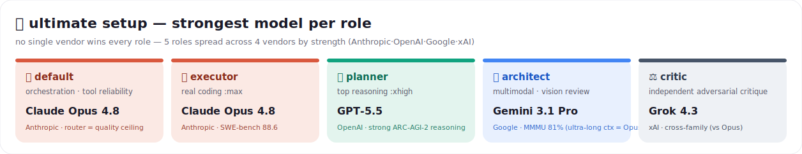
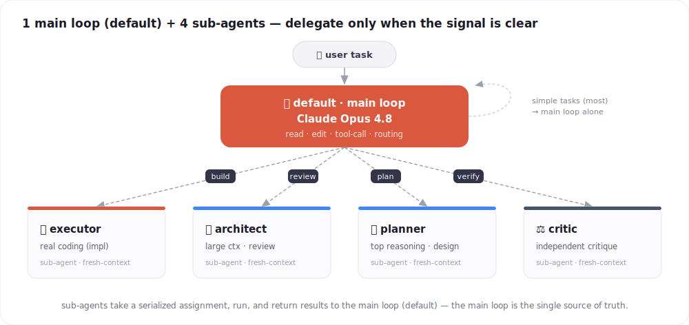
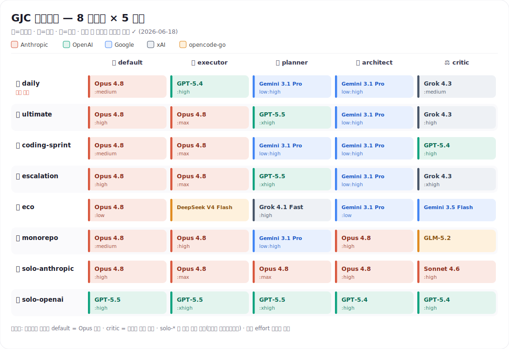
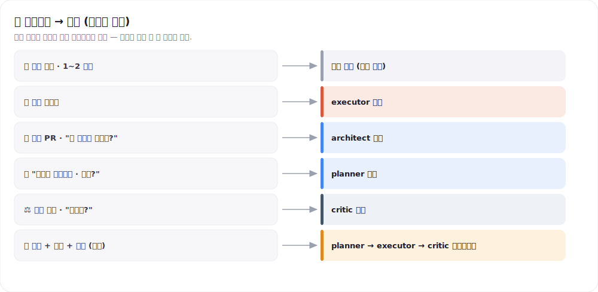
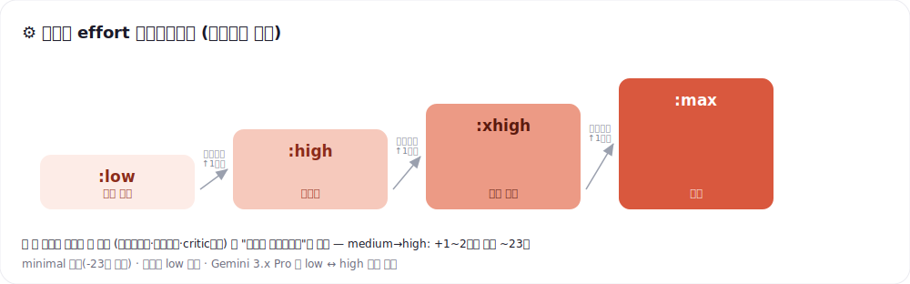

<div align="center">

# 🧩 GJC 多厂商极限配置

### claude · gpt · grok · gemini · opencode go — 把 5 个订阅*按角色*拆分使用的已验证配置

不用再纠结选哪个模型。**一行安装**，让每个角色自动用上最合适的模型。

[-e23?style=flat-square)](https://github.com/Yeachan-Heo/gajae-code)
[](./CHANGELOG.md)
[](https://github.com/Yeachan-Heo/gajae-code/pull/860)




</div>

**[한국어](./README.md) · [English](./README.en.md) · 中文（本页） · [日本語](./README.ja.md)**

> [!NOTE]
> **本指南的核心已被采纳进 GJC 官方文档** — 精简版已合并到上游 [`docs/multi-vendor-profiles.md`](https://github.com/Yeachan-Heo/gajae-code/blob/dev/docs/multi-vendor-profiles.md)（[PR #860](https://github.com/Yeachan-Heo/gajae-code/pull/860)，`dev`）。角色/选择器概念请以 **GJC 官方文档为权威参考**；本仓库提供官方文档没有的东西 —— **一行安装脚本**、**完整的 10 套配置**（含 `solo-*` / `claude-codex*`），以及[维护与验证工具](./MAINTAINING.md)（静态检查 CI + 实时选择器测试 + 目录漂移追踪）。

---

## ⚡ 30 秒安装（一行复制粘贴）

```bash
curl -fsSL https://raw.githubusercontent.com/project820/gjc-multivendor-setup-guide/main/install.sh | bash
```

这一行会**把 10 套配置安全合并进 `~/.gjc/agent/models.yml`**，并把默认配置设为 `daily`。原有配置会自动备份，重复执行也会干净地原地更新。

```bash
gjc --mpreset daily        # 仅本次会话生效
gjc                        # 新会话自动使用 daily
```

> [!IMPORTANT]
> **安装后必须登录各厂商。** GJC 使用自己的 OAuth（不与原生 `agy`/`grok` CLI 登录共享），所以打开 GJC 后各执行一次（浏览器认证）：
>
> ```text
> /login anthropic           # claude
> /login openai-codex        # gpt（ChatGPT 账号 → 提供 base GPT）
> /login google-antigravity  # gemini（Google AI Pro/Ultra 订阅）
> /login xai                 # grok 全系列 + Composer
> ```
> opencode-go 用 API key：`/provider add` 或环境变量 `OPENCODE_API_KEY`。用 `/provider` 查看认证状态。

> [!TIP]
> 指定默认配置：`curl -fsSL …/install.sh | GJC_SETUP_DEFAULT=ultimate bash` · 跳过默认设置：`GJC_SETUP_DEFAULT=none`。

---

## 1. 🎯 为什么要多厂商

订阅了 claude·gpt·grok·gemini·opencode go 却只用一个模型，等于在每个角色上都用*次优*模型。已验证的基准显示**各角色的领先厂商各不相同**：

| 角色 | 做什么 | 最佳模型 |
|---|---|---|
| 🧠 **推理/规划**（planner） | 排序、验收标准 | **Gemini 3.1 Pro**（GPQA 94.3 / ARC-AGI-2 77.1） |
| 🔨 **实现**（executor） | 真正写/改代码 | **Claude Opus 4.8**（SWE-bench Verified 88.6） |
| 🔭 **代码评审**（architect） | 大型仓库导航、架构 | **Gemini 3.1 Pro**（多模态 MMMU-Pro 81%）· 超长上下文（>200k）→ **Opus** |
| ⚖️ **独立批评**（critic） | 对抗式验证 | **跨厂商**（与主循环不同厂商） |
| 🎛️ **编排**（default） | 工具调用、路由、诚实性 | **Claude Opus 4.8**（路由质量决定系统上限） |

> 用一个厂商填满 5 个角色，必然至少有一个角色不是最强。本指南把这 5 个角色各自配上最合适的厂商，并在成本、可用性、可靠性之间权衡，整理成一个**真正能用**的组合。它交叉验证了三份独立深度调研（GPT-5.5 · Claude Opus 4.8 · Gemini 3.1 Pro），并**用真实调用验证了每个配置选择器**（[§6](#6--验证矩阵)）。

---

## 2. 🧭 核心设计

> **固定一个强主循环（default = Opus）+ 按信号委派 + 按失败升档 effort。**

每一轮真正运行的只有 `default`（主循环）。executor/architect/planner/critic 是主循环**仅在必要时通过 `task` 委派**的子代理（全新上下文）。

<div align="center">

</div>

三条设计原则：

- **主循环绝不让步。** 大多数中位任务由主循环独自处理，所以把 `default` 降成弱模型会让整体体感质量崩塌。始终用 Opus。
- **多样性只在「验证」环节获益。** 让 `critic` 用不同厂商以保持独立，但串行链要短（可靠性按 `0.99ⁿ` 衰减）。
- **effort 是非对称经济学。** `medium→high` 只提升 1~2 分却要约 23 倍 token。无脑拉满是浪费 —— 只在「解不出来」时才升档。

---

## 3. 🔧 GJC 引擎事实

### 3-1. 五个角色

| 角色 | 运行位置 | 首要能力 |
|---|---|---|
| `default` | **主循环** | 工具调用可靠性 · 诚实性 |
| `executor` | 子代理（仅 `task` 委派时） | 真实编码（SWE-bench） |
| `architect` | 子代理 | 大上下文 · 多模态代码评审 |
| `planner` | 子代理 | 顶级推理 · 排序 |
| `critic` | 子代理 | 独立对抗式批评 |

### 3-2. Effort 速查表

```text
Opus 4.6/4.7/4.8        minimal low medium high xhigh max   ← 全 6 档
Sonnet 4.6              minimal low medium high              ← 无 xhigh/max
GPT 5.4 / 5.5 (base)    low medium high xhigh                ← 5.5 默认 xhigh
Grok 4.x（如 4.3）       minimal low medium high xhigh
opencode-go deepseek-v4  minimal low medium high xhigh
opencode-go 其他         ── 省略 :effort 后缀（用默认）──
google-antigravity Gemini  gemini-3.1-pro-low:high（高推理）· gemini-3.1-pro-low（低 effort）
```

> [!IMPORTANT]
> **四条硬规则**：① Gemini Pro 只支持 `low`/`high` ② openai-codex 上下文 **272k 上限**（大型代码库需排除）③ Sonnet 不支持 `xhigh`/`max` ④ opencode-go 省略 `:effort`。超范围的档位会被**夹取（clamp）**而非报错。

### 3-3. 订阅 → 提供方

| 订阅 | provider-id | 备注 |
|---|---|---|
| claude | `anthropic` | 全 effort |
| gpt | `openai-codex` | **ChatGPT 账号 → 提供 base GPT（gpt-5.5/5.4）**。上下文 272k |
| grok | `xai` | 全系列 + Composer |
| gemini | `google-antigravity` | **Google AI Pro/Ultra 订阅 token**。Gemini + 捆绑的 Claude（Opus 4.6） |
| opencode go | `opencode-go` | API key（`OPENCODE_API_KEY`） |

> [!NOTE]
> **openai-codex 路径注意**：用 ChatGPT（Codex）账号登录会提供 **base GPT 模型（`gpt-5.5`、`gpt-5.4`）**。独立的 `-codex` 变体（`gpt-5.3-codex`、`gpt-5.2-codex`、`gpt-5.1-codex-max/mini`）在此路径下**不受支持**（`not supported when using Codex with a ChatGPT account`），因此本指南的编码角色也统一使用已验证的 **base GPT**。
>
> 备选路径：`google-vertex`（API key，按 token 付费，1M 上下文）—— 与订阅/配额无关的兜底。

### 3-4. 选择器语法

```text
<provider-id>/<model-id>:<effort>            例）anthropic/claude-opus-4-8:high
google-antigravity/gemini-3.1-pro-low:high   （Gemini 高推理 —— 引擎的官方路径）
opencode-go/<model>                           （省略 effort = 模型默认）
```

---

## 4. 📊 基准依据

**各角色已验证的领先者**（vals.ai 独立榜单 · 官方模型卡）

| 角色（维度） | 领先者 | 数据 |
|---|---|---|
| executor（SWE-bench Verified） | **Opus 4.8** | 88.6%（GPT-5.5 82.6 · Gemini 3.1 Pro 80.6） |
| planner（推理 GPQA/ARC-AGI） | **Gemini 3.1 Pro** | GPQA 94.3 · ARC-AGI-2 77.1 |
| architect（上下文 · 多模态） | **Gemini 3.1 Pro** | 1M 上下文 · MMMU-Pro 81% |
| default（工具调用 · 诚实性） | **Opus 4.8** | 路由质量 = 全系统上限 |
| critic（独立性） | **跨厂商** | 元裁判 > 辩论式聚合 |

**共识原则**

1. **default = Opus 4.8 固定**（多厂商配置）—— 路由质量是上限。`solo-*` 用该单厂商最强者作 default。
2. **architect = Gemini 3.1 Pro（多模态）/ Opus（超长上下文）** —— Gemini 适合视觉与中等上下文；200k+ 文本检索用 Opus（MRCR 76%@1M，而 Gemini 崩到 26%）。
3. **critic = 跨厂商** —— 与主循环/规划者不同厂商可缓解自我偏好偏差。
4. **结构 = 强主循环 + 按信号委派 + 按失败升档 effort。**
5. **不要逐查询切换配置** —— 缓存损失 > 收益。只在模式边界切换。

> 基准对时间敏感 → 建议每季度复验。绝对排名仅限 vals.ai 独立榜单。

---

## 5. 🗂️ 最终目录（10 套配置）

<div align="center">

</div>

> ★ = 日常推荐。顶部横幅 = **`ultimate` 配置**（各角色最强、精度优先）。把它按成本平衡降一档就是推荐的 **`daily`**（仅 executor·critic 换成更便宜的）。多厂商配置保持 `default=Opus`、`critic=跨厂商`（solo-* 用单厂商最强），全部通过引擎 effort 硬规则，且**每个选择器都经实时验证**（[§6](#6--验证矩阵)）。

| 配置 | 一句话 | 何时用 |
|---|---|---|
| ⭐ **daily** | Opus 主循环 + 委派给各角色最佳厂商 | **日常默认** |
| 🏆 **ultimate** | 不计成本，各角色最强 | 精度比成本更重要 |
| 🏎️ **coding-sprint** | executor 主导 + 懂代码的 critic | 纯实现吞吐 |
| 🛡️ **escalation** | 全局最高档 + 多厂商 critic 评审团 | 合并·安全·支付·不可逆变更 |
| 💸 **eco** | 仅主循环用 Opus，委派全用便宜/订阅模型 | 成本压力·大批量 |
| 🗺️ **monorepo** | 全局 ≥1M 上下文（排除 codex） | 巨型代码库 |
| 🧱 **solo-anthropic** | 全角色 Anthropic | 仅单厂商运营 |
| 🤖 **solo-openai** | 全角色 base GPT（272k 上下文） | 只订阅 ChatGPT |
| 🤝 **claude-codex** | Claude=执行·上下文 / Codex=推理·批评 | 仅 Claude+Codex 两订阅 |
| 🥇 **claude-codex-max** | claude-codex 的不计成本最强版 | Claude+Codex · 精度优先 |

<details>
<summary><b>📋 展开完整 YAML（与 gjc-profiles.yml 一致）</b></summary>

```yaml
profiles:

  daily:                               # ★ 日常默认 (--default daily)
    required_providers: [anthropic, openai-codex, google-antigravity, xai]
    model_mapping:
      default:   anthropic/claude-opus-4-8:medium               # 主循环效率拐点
      executor:  openai-codex/gpt-5.4:high                      # 擅长编码·中等价位($2.5/15)·分散厂商
      planner:   google-antigravity/gemini-3.1-pro-low:high     # 已验证推理第一(GPQA 94.3 / ARC-AGI-2 77.1)
      architect: google-antigravity/gemini-3.1-pro-low:high     # 1M 上下文·多模态(MMMU-Pro 81%)
      critic:    xai/grok-4.3:medium                            # 跨厂商廉价独立批评($1.25/2.5)

  ultimate:                            # 不计成本，各角色最强 + 分散厂商
    required_providers: [anthropic, openai-codex, google-antigravity, xai]
    model_mapping:
      default:   anthropic/claude-opus-4-8:high
      executor:  anthropic/claude-opus-4-8:max                  # 可用范围内编码第一(SWE-bench Verified 88.6)
      planner:   openai-codex/gpt-5.5:xhigh                     # 顶级推理 + OpenAI 多样性
      architect: google-antigravity/gemini-3.1-pro-low:high     # 1M 上下文·多模态
      critic:    xai/grok-4.3:high                              # 跨厂商独立批评

  coding-sprint:                       # 实现吞吐。executor 主导 + 懂代码的 critic
    required_providers: [anthropic, openai-codex, google-antigravity]
    model_mapping:
      default:   anthropic/claude-opus-4-8:medium               # 主循环编排
      executor:  anthropic/claude-opus-4-8:max                  # 可用范围内编码第一(88.6)
      planner:   google-antigravity/gemini-3.1-pro-low:high     # 推理第一，用于轻量规划
      architect: google-antigravity/gemini-3.1-pro-low:high     # 1M 上下文评审
      critic:    openai-codex/gpt-5.4:high                      # 懂代码的 critic(抓真实 bug)，跨厂商 vs gemini

  escalation:                          # 高失败成本。全局最高档 + 多厂商 critic 评审团(§9)
    required_providers: [anthropic, openai-codex, google-antigravity, xai]
    model_mapping:
      default:   anthropic/claude-opus-4-8:high
      executor:  anthropic/claude-opus-4-8:max
      planner:   openai-codex/gpt-5.5:xhigh
      architect: google-antigravity/gemini-3.1-pro-low:high
      critic:    xai/grok-4.3:xhigh                             # + 3 票跨厂商 critic 评审团(独立投票→主循环汇总)

  eco:                                 # 最省 —— 仅主循环用 Opus(降 effort)，委派全用超低价/订阅模型
    required_providers: [anthropic, opencode-go, google-antigravity, xai]
    model_mapping:
      default:   anthropic/claude-opus-4-8:low                  # 路由不能降，只能降 effort
      executor:  opencode-go/deepseek-v4-flash                  # $0.14/0.28, 1M, 最便宜的 coder(第 5 厂商)
      planner:   xai/grok-4-1-fast:high                         # $0.2/0.5, 2M, 廉价推理
      architect: google-antigravity/gemini-3.1-pro-low          # 订阅 token，低 effort，1M 上下文
      critic:    google-antigravity/gemini-3.5-flash            # 订阅 token，轻量，跨厂商 vs executor(opencode-go)

  monorepo:                            # 巨型代码库 —— 全局 1M 上下文(★排除 codex 272k)
    required_providers: [anthropic, google-antigravity, opencode-go]
    model_mapping:
      default:   anthropic/claude-opus-4-8:medium               # 1M
      executor:  anthropic/claude-opus-4-8:high                 # 1M
      planner:   google-antigravity/gemini-3.1-pro-low:high     # 推理(范围化输入)
      architect: anthropic/claude-opus-4-8:high                 # Opus 4.8 = GJC 1M 上下文窗口(多轮累积检索最佳)。单条消息粘贴上限约 400k —— 一次性 >400k 用 opencode-go/deepseek-v4-pro
      critic:    opencode-go/glm-5.2                            # 新开源权重第一(AA 51 > V4 Pro 44)，跨厂商 vs anthropic(备选: deepseek-v4-pro)

  solo-anthropic:                      # 仅单厂商运营，规避 0.99^N 可靠性崩塌
    required_providers: [anthropic]
    model_mapping:
      default:   anthropic/claude-opus-4-8:high
      executor:  anthropic/claude-opus-4-8:max
      planner:   anthropic/claude-opus-4-8:max
      architect: anthropic/claude-opus-4-8:high                 # 1M, 替代 Gemini(兜底第一)
      critic:    anthropic/claude-sonnet-4-6:high               # ⚠同厂商=独立性弱(权衡)

  solo-openai:                         # 仅 ChatGPT(Codex)账号 —— 只用 base GPT(★上下文 272k 上限)
    required_providers: [openai-codex]
    model_mapping:
      default:   openai-codex/gpt-5.5:high                      # 路由(最强 base GPT)
      executor:  openai-codex/gpt-5.5:xhigh                     # 此账号最强 coder
      planner:   openai-codex/gpt-5.5:xhigh                     # 顶级推理
      architect: openai-codex/gpt-5.4:high                      # 272k 上限 —— 不适合巨型代码库
      critic:    openai-codex/gpt-5.4:high                      # ⚠同厂商=独立性弱(权衡)

  claude-codex:                        # ★仅 Claude+Codex(两订阅) —— 日常均衡。Anthropic=执行·上下文 / Codex=推理·批评
    required_providers: [anthropic, openai-codex]
    model_mapping:
      default:   anthropic/claude-opus-4-8:medium               # 路由·工具可靠
      executor:  anthropic/claude-opus-4-8:high                 # 编码第一(SWE-bench 88.6)
      planner:   openai-codex/gpt-5.5:high                      # OpenAI 推理旗舰
      architect: anthropic/claude-opus-4-8:high                 # 1M 窗口(规避 codex 272k 限制)
      critic:    openai-codex/gpt-5.4:high                      # 跨厂商 vs Opus(executor)，懂代码

  claude-codex-max:                    # Claude+Codex(两订阅)最强 —— 不计成本
    required_providers: [anthropic, openai-codex]
    model_mapping:
      default:   anthropic/claude-opus-4-8:high
      executor:  anthropic/claude-opus-4-8:max                  # SWE-bench 88.6 编码第一
      planner:   openai-codex/gpt-5.5:xhigh                     # 顶级推理(ARC-AGI-2 强)
      architect: anthropic/claude-opus-4-8:high                 # 1M 窗口
      critic:    openai-codex/gpt-5.5:high                      # 跨厂商独立批评 vs Opus
```

</details>

各配置的设计理由、按需速查表，以及完整的深度调研基准分析（planner 推理分裂、architect 长上下文校正、GJC 有效上下文实测），见 **[韩文权威 README](./README.md#5--최종-카탈로그-10종)** 和官方 **[GJC 文档](https://github.com/Yeachan-Heo/gajae-code/blob/dev/docs/multi-vendor-profiles.md)**。

---

## 6. ✅ 验证矩阵

> 每个选择器都在本环境通过 `gjc -p --no-session --no-tools --model <sel> "..."` **真实调用**确认过（2026-06-18）。「能用」是真实调用的结果，不是猜测。

| 提供方 | 已验证选择器（✅ 可用） |
|---|---|
| `anthropic` | `claude-opus-4-8`（low·medium·high·max）· `claude-sonnet-4-6:high` |
| `openai-codex` | `gpt-5.5`（high·xhigh）· `gpt-5.4:high` · `gpt-5.4-mini:high` |
| `xai` | `grok-4.3`（high·xhigh）· `grok-4-1-fast:high` · `grok-4-fast:high` · `grok-code-fast-1` · `grok-composer-2.5-fast` |
| `google-antigravity` | `gemini-3.1-pro-low` · `gemini-3.1-pro-low:high` · `gemini-3.5-flash` · `gemini-3-flash` · `claude-opus-4-6-thinking` |
| `opencode-go` | `deepseek-v4-flash` · `deepseek-v4-pro` · `glm-5.2` · `glm-5.1` · `minimax-m2.7` · `qwen3.7-max` · `kimi-k2.6` · `mimo-v2.5`（需 `OPENCODE_API_KEY`） |

> [!WARNING]
> **本环境下不可用的选择器**（避免）：`openai-codex/gpt-5.3-codex`·`gpt-5.2-codex`·`gpt-5.1-codex-max`·`gpt-5.1-codex-mini`（ChatGPT 账号不支持）· `google-antigravity/gemini-3.1-pro-high`（引擎用 `gemini-3.1-pro-low:high`）· `gemini-3-pro`（已退役）· `claude-sonnet-4-6-thinking`（404）· `gpt-oss-120b`（500）。`opencode-go/*` **仅在未设 `OPENCODE_API_KEY` 时**失败（设置后按上表可用）。

> [!NOTE]
> `opencode-go/glm-5.2` 与 `google-antigravity/gemini-3.5-flash` 是来自**提供方实时目录、而非捆绑快照**（`packages/ai/src/models.json`）的 id。登录后在线发现填充注册表即可解析（上面已验证 ✅）。但 `required_providers` 只验证凭据、不保证发现的新鲜度，所以在刷新前激活可能以 `selector did not resolve` 失败。遇到时重新登录/重试以刷新，或替换为捆绑 id：critic 用 `opencode-go/deepseek-v4-pro`，GLM 用 `zai/glm-5.2`（把 `zai` 加入 `required_providers`）。

复现：
```bash
gjc -p --no-session --no-tools --model "google-antigravity/gemini-3.1-pro-low:high" "Reply exactly: OK"
gjc -p --no-session --no-tools --model "openai-codex/gpt-5.4:high" "Reply exactly: OK"
```

> **深度角色配置复查与 GJC 有效上下文实测**（韩文权威版 §6-2 / §6-3）确认骨架接近最优：`gemini-3.1-pro-low:high` 调用的是 Gemini 原生高推理模式（非降级）；planner 推理维度分裂（Gemini 赢 GPQA，GPT-5.5 赢 ARC-AGI-2）；Opus 在 1M 上下文检索上保持优势而 Gemini 崩溃（因此 monorepo architect = Opus）；单条 `@file` 输入上限（anthropic/antigravity 约 400k）与 1M 上下文窗口是两回事（巨型输入应跨轮分块）。完整表格见 **[韩文 README §6](./README.md#6--검증-매트릭스)**。

---

## 7. 🛠️ 安装 / 卸载

### 一键（推荐）

```bash
curl -fsSL https://raw.githubusercontent.com/project820/gjc-multivendor-setup-guide/main/install.sh | bash
```

安装脚本做的事：把 10 套配置安全合并进 `~/.gjc/agent/models.yml`（重复执行自动更新）、自动备份原文件、把默认配置设为 `daily`。只需 `curl` + `python3`。

```bash
# 选项
curl -fsSL …/install.sh | GJC_SETUP_DEFAULT=ultimate bash    # 指定默认配置
curl -fsSL …/install.sh | GJC_SETUP_DEFAULT=none bash        # 跳过默认设置
curl -fsSL …/install.sh | GJC_CODING_AGENT_DIR=/path bash    # 覆盖 agent 目录
```

### 厂商认证（必需）

安装只放置配置。打开 GJC 后给每个厂商登录一次：

```text
/login anthropic           # claude
/login openai-codex        # gpt（base GPT）
/login google-antigravity  # gemini（Google AI Pro/Ultra 订阅）
/login xai                 # grok 全系列 + Composer
```

opencode-go：`/provider add` 或环境变量 `OPENCODE_API_KEY`。

### 手动安装 / 验证 / 卸载

把 [`gjc-profiles.yml`](./gjc-profiles.yml) 的 `profiles:` 块粘贴到 `~/.gjc/agent/models.yml` 的 `profiles:` 下，然后 `gjc --mpreset daily --default`。

```bash
gjc --list-models daily                       # 确认
cp ~/.gjc/agent/models.yml.bak-*  ~/.gjc/agent/models.yml   # 回滚(恢复备份)
```

---

## 8. 🔀 动态路由

> **「逐查询切换配置」❌ /「一个强主循环 + 一层薄规则」✅。** 路由者是主循环（Opus），配置是目的地池。

> [!TIP]
> 想让主循环遵循下面的路由规则，把 [`routing-rules.md`](./routing-rules.md) 放进项目 `AGENTS.md`，或用 `gjc --append-system-prompt @routing-rules.md` 注入（已装配置 + 已验证选择器硬规则 + GJC 有效上下文上限，全在一个文件里）。

### 8-1. 工作信号 → 委派

<div align="center">

</div>

规则：**只在信号明确时委派。** 主循环能直接做就直接做。

### 8-2. 自适应 effort 升档

<div align="center">

</div>

- ✅ 因解不出而升档是正当的 / ❌「为了保险升档」是浪费。
- 禁用 minimal。下限到 `low`。Gemini 是 `low↔high` 单跳。

### 8-3. 配置切换（仅模式边界）

| 信号 | 切换 → |
|---|---|
| 会话开始 · 一般工作 | `daily` |
| 合并/发布前 · 安全 · 支付 | `escalation` |
| 大批量重构 · 迁移 | `eco` |
| 进入巨型代码库 | `monorepo` |
| 仅单厂商运营 | `solo-anthropic` |

---

## 9. 🧪 并行代理 + 可靠性

串行交接按 `0.99ⁿ` 衰减，多代理若连接不当会固化成「虚假共识」。并行设计要同时防住这两点。

```text
串行链 5 步(各 0.99)：  0.99^5 ≈ 95.1%    → 越长越崩
并行独立 5 个(OR 成功)： 1-(0.01)^5 ≈ 100%  → 多样性提升可靠性
```

**设计原则**
- critic = **与主循环不同厂商，并行独立投票后由主循环汇总**（禁止辩论 —— 元裁判更优）。
- critic 评审团示例：`{xai/grok-4.3, openai-codex/gpt-5.4, google-antigravity/gemini-3.1-pro-low:high}` 并行 → 2/3 反对则废弃。
- executor 扇出仅在**工作真正独立**（无共享状态）时。
- 链要短，主循环作为唯一事实源（子代理之间不直接达成共识）。

---

## 10. 💰 成本

Gemini（`google-antigravity`）以 **Google AI Pro/Ultra 订阅 token** 运行（包含在订阅内，非按 token 计费）。其余按 token 计费，主要模型单价如下（$/1M，输入/输出）：

| 模型 | $/1M (in/out) | 角色 |
|---|---|---|
| Claude Opus 4.8 | 5 / 25 | default·executor |
| Claude Sonnet 4.6 | 3 / 15 | solo critic |
| GPT-5.5 | 5 / 30 | planner(ultimate) |
| GPT-5.4 | 2.5 / 15 | executor/critic(daily·sprint) |
| Grok 4.3 | 1.25 / 2.5 | critic |
| Grok 4.1 Fast | 0.2 / 0.5 | eco planner |
| DeepSeek V4 Flash / Pro (opencode-go) | 0.14/0.28 · 1.74/3.48 | eco executor · monorepo critic |
| Gemini 3.1 Pro / 3.5 Flash | 订阅 token | planner·architect·critic |

**配置相对成本**

| 配置 | 成本 | 主要成本来源 |
|---|---|---|
| ultimate / escalation | ●●●●● | executor Opus `:max` + planner GPT-5.5 `:xhigh` |
| coding-sprint | ●●●●○ | executor Opus `:max` |
| daily | ●●●○○ | 主循环 Opus `:medium`，委派中/低价分散 |
| monorepo | ●●●○○ | executor Opus + Grok/Gemini(订阅) |
| solo-anthropic | ●●●○○ | 全 Opus(仅 critic 用 Sonnet) |
| eco | ●○○○○ | executor DeepSeek V4 Flash($0.14) + 订阅 Gemini |

> **三大省钱杠杆**：① 把委派工作推给超低价模型（DeepSeek V4 Flash $0.14、Grok Fast $0.2）/ 订阅 token（Gemini）② 只在失败时升档 effort ③ 主循环保持 Opus（质量上限），日常用 `:medium`，成本紧张时 `:low`。

---

## 11. 📖 来源

**编码（executor）** · [Vals SWE-bench Verified](https://www.vals.ai/benchmarks/swebench) · [swebench.com](https://www.swebench.com/verified.html) · [Terminal-Bench 2.0](https://www.tbench.ai/leaderboard/terminal-bench/2.0)

**推理（planner）** · [Gemini 3.1 Pro card](https://deepmind.google/models/model-cards/gemini-3-1-pro/) · [AA Index](https://artificialanalysis.ai/evaluations/artificial-analysis-intelligence-index)

**上下文 · 多模态（architect）** · [Gemini 3](https://blog.google/products-and-platforms/products/gemini/gemini-3/)

**工具调用 · 诚实性（default）** · [BFCL](https://gorilla.cs.berkeley.edu/leaderboard.html) · [τ²-Bench](https://arxiv.org/abs/2506.07982)

**独立性 · 路由（critic + 设计）** · [self-preference bias](https://arxiv.org/abs/2410.21819) · [Judging with Many Minds](https://arxiv.org/abs/2505.19477) · [RouteLLM](https://www.lmsys.org/blog/2024-07-01-routellm/)

**官方模型/价格** · [Anthropic](https://docs.anthropic.com/en/docs/about-claude/models) · [OpenAI](https://openai.com/api/pricing/) · [xAI](https://docs.x.ai/developers/models)

---

<div align="center">

**一行安装，各角色用最佳模型。**

**v1.3** · [CHANGELOG](./CHANGELOG.md) · [维护手册](./MAINTAINING.md) · 许可证 [CC BY 4.0](./LICENSE) · GJC = [Gajae Code](https://github.com/Yeachan-Heo/gajae-code)

</div>
